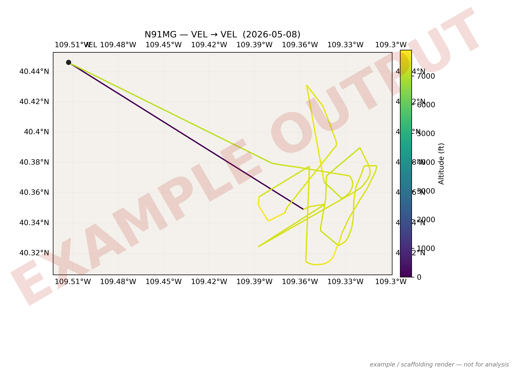
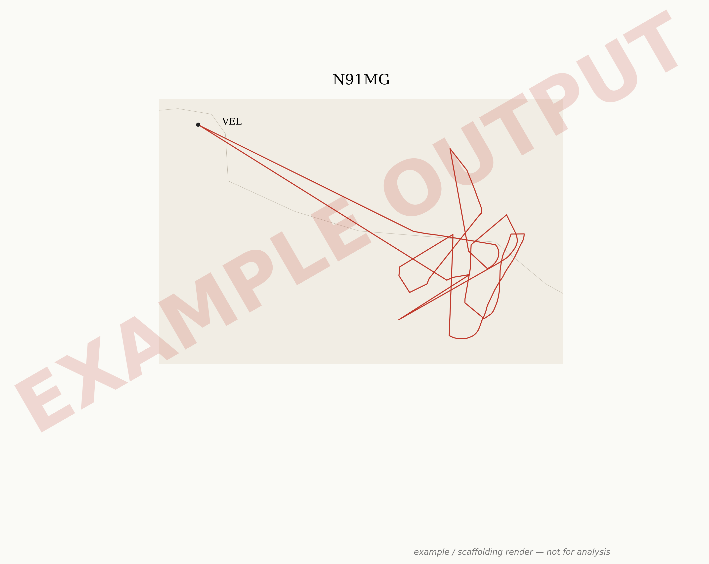

# flight-maps

Visualise FlightRadar24 (FR24) CSV+KML flight tracks alongside metadata from the FlightAware iOS app, producing static publication maps, interactive web views, Kepler.gl 3D ribbons, and minimalist topographic line-art.

Built at the Bingham Research Center, Utah State University, for the Uinta Basin research-flight programme.

## Data sources

- **CSV / KML track exports**: FlightRadar24. Schema: `test_examples/fr24/SCHEMA.md`.
- **App screenshots → metadata**: FlightAware iOS app. Transcribed into `metadata/extra-metadata-<image>.md`.

A future FlightAware CSV/KML exporter is supported by stub at `src/flight_maps/parsers/flightaware.py`; populate when a sample arrives.

## Quickstart

```bash
mamba env create -f environment.yml
mamba activate flight-maps
pip install -e .

pytest -q
python scripts/run_all.py 3f99ca78          # for analysis: clean renders
python scripts/run_all.py 3f99ca78 --example  # stamps EXAMPLE OUTPUT watermark
```

Outputs land in `outputs/` (gitignored). Reference renders of the bundled demo flight live in [`examples/3f99ca78/`](examples/3f99ca78/) and are previewed below.

- `static_<id>.png` — cartopy publication map.
- `interactive_<id>.html` — Plotly map + altitude profile.
- `kepler_<id>/{track.csv,config.json}` — drag into <https://kepler.gl/demo>.
- `art_topo_<id>.png` — minimalist topographic line-art.

## Example output

> The renders below carry a large red **EXAMPLE OUTPUT** watermark on purpose — they are scaffolding artefacts of the bundled demo flight (`3f99ca78` — N91MG, KVEL→KVEL, 2026-05-08), not analytical results. Real analysis runs without `--example` and produces clean images.

### Static cartopy map



### Topographic line-art



The Plotly interactive HTML and Kepler.gl export sit alongside in [`examples/3f99ca78/`](examples/3f99ca78/).

## Adding a new flight

1. Drop FR24 `<id>.csv` and `<id>.kml` into `test_examples/fr24/` (or any directory; pass full paths).
2. Add screenshots to `images/` and transcribe each into `metadata/extra-metadata-<image-stem>.md` using `metadata/TEMPLATE.md`.
3. Create `metadata/flight-<id>.md` linking the per-image files.
4. `python scripts/run_all.py <id>`.

## Repo map

See [CLAUDE.md](CLAUDE.md) for the indexed cold-start view used by AI agents (and humans in a hurry).

## License

MIT — see [LICENSE](LICENSE).
